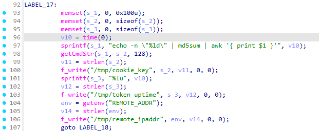
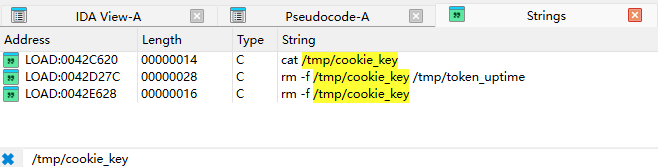

# Technical Details: TOTOLINK N600R V4.3.0cu.7866 Predictable Session Token

## 1. Firmware & Binary

| Property | Value |
|----------|-------|
| Firmware | V4.3.0cu.7866_B20220506 |
| Build Date | 2022-05-06 16:22:31 (embedded in binary) |
| CPU | MIPS 32-bit big-endian |
| Vulnerable Binary | `cstecgi.cgi` |
| Binary Path | `/web_cste/cgi-bin/cstecgi.cgi` |
| MD5 | See `binaries/cstecgi.cgi` |

## 2. Architecture

In V4.3.0cu.7866, `cstecgi.cgi` is the single CGI entry point handling all web requests, including login authentication. The binary is linked against:

- `libapmib.so` — configuration/MIB management
- `libcjson.so` — JSON parsing
- `libmystdlib.so` — custom utility functions

The login flow:

```
POST /cgi-bin/cstecgi.cgi
  Body: {"topicurl":"setting/loginAuth", ...}
         │
         ▼
  sub_415A38 (loginAuth handler)
         │
         ├── Verify username/password (apmib_get 182, 183)
         ├── Generate token: cookie_key = md5(time(NULL))
         ├── Write /tmp/cookie_key
         └── Return JSON with jump_page redirect
```

## 3. IDA Pro Reverse Engineering

### 3.1 Function: `sub_415A38` @ `0x415A38`

This function handles the `setting/loginAuth` endpoint. The full decompiled output is shown below with annotations.

#### 3.1.1 Credential Verification

```c
// Parse login parameters from JSON payload
Var  = websGetVar(a1, "username", "");
v3   = websGetVar(a1, "password", "");
nptr = websGetVar(a1, "flag", "");

// Read stored credentials from MIB
apmib_get(182, stored_username);  // MIB index 182 = admin username
apmib_get(183, stored_password);  // MIB index 183 = admin password
apmib_get(192, &n2);

// Verify credentials
if (*Var && *v3
    && strcmp(Var, stored_username) == 0
    && password_verify(v3, stored_password)) {
    loginflag = 0;  // Authentication success
}
```


#### 3.1.2 Token Generation (Address `0x415E58`)

```c
// ─── TOKEN GENERATION: address 0x415E58 ───

v10 = time(0);  // ← Unix timestamp (seconds since epoch)

// Construct shell command:
//   echo -n "<timestamp>" | md5sum | awk '{ print $1 }'
sprintf(s_1,
    "echo -n \"%ld\" | md5sum | awk '{ print $1 }'",
    v10);                              // @ 0x415E6C

// Execute via popen(), capture output
getCmdStr(s_1, s_2, 128);             // @ 0x415E84
    // s_2 now contains: md5(timestamp) as 32-char hex string

// Write token to file
f_write("/tmp/cookie_key", s_2, v11, 0, 0);  // @ 0x415EB8
    // This file contains the session token

// Write raw timestamp to file (for debugging)
sprintf(s_3, "%lu", v10);             // @ 0x415ED4
f_write("/tmp/token_uptime", s_3, v12, 0, 0); // @ 0x415F08
    // This file leaks the exact timestamp
```



#### 3.1.3 Response Construction

```c
// On success, construct redirect response
if (n2 == 2) {
    strcpy(redirect_page, "home.asp");
} else if (atoi(nptr) == 1) {
    strcpy(redirect_page, "mobile/home.asp");
} else if (first_login == 1) {
    strcpy(redirect_page, "home.asp");
} else {
    strcpy(redirect_page, "wizard.asp");
}

// Build JSON response with jump_page
cJSON_AddItemToObject(response, "login_flag", loginflag);
cJSON_AddItemToObject(response, "jump_page", redirect_page);
puts(cJSON_Print(response));
```

#### 3.1.4 Logout / Cleanup

```c
// When login fails or user logs out:
system("rm -f /tmp/cookie_key /tmp/token_uptime");  // @ 0x41604C
```

### 3.2 Key String References

| Address | String | Context |
|---------|--------|---------|
| `0x42D21C` | `echo -n "%ld" \| md5sum \| awk '{ print $1 }'` | Token generation shell command |
| `0x42D248` | `/tmp/token_uptime` | Raw timestamp file (written by `f_write`) |
| `0x42D292` | `/tmp/token_uptime` | Used in `rm -f /tmp/token_uptime` |
| `0x42C624` | `/tmp/cookie_key` | Session token file (written by `f_write`) |
| `0x42D282` | `/tmp/cookie_key` | Used in `rm -f /tmp/cookie_key` |
| `0x42E62E` | `/tmp/cookie_key` | Used in `cat /tmp/cookie_key` |
| `0x42E650` | `token invalid` | Auth failure response |
| `0x42E640` | `Login timeout` | Session expiry response |
| `0x42E5AC` | `setting/loginAuth` | HTTP API endpoint for login |
| `0x42D22C` | `md5sum` | Part of token generation command |



### 3.3 Relevant Imports

| Import | PLT Address | Role |
|--------|-------------|------|
| `time` | `0x4415B4` | **Only source of randomness for token** |
| `gettimeofday` | `0x4415D0` | Higher-precision time (unused for token) |
| `sprintf` | `0x4415A8` | Format shell command string |
| `getCmdStr` | `0x441558` | Execute shell via `popen()`, capture stdout |
| `system` | `0x4416AC` | `rm -f /tmp/cookie_key` on logout |
| `f_write` | `0x441588` | Write token to filesystem |
| `getenv` | `0x4416E0` | Read `REMOTE_ADDR` for logging |

## 4. Token Predictability Analysis

### 4.1 Entropy Source

The token is derived from a single call to `time(0)`:

```
Token = MD5(Unix timestamp)
```

- `time(0)` returns seconds since Unix epoch
- At the time of login, this value falls within a narrow window
- No additional entropy (no PID, no random bytes, no counter)

### 4.2 Search Space

An attacker who knows the approximate time of login can brute-force the token. The practical attack window is bounded by the session timeout (`Login timeout` response observed in the binary — exact duration unknown, but typical for routers is 3–5 minutes of inactivity).

| Window | Candidates | Time (1 thread, ~20 req/s) |
|--------|-----------|----------------------------|
| 5 minutes | 300 | ~15 seconds |
| 30 minutes | 1,800 | ~90 seconds |
| 1 hour | 3,600 | ~3 minutes |

**Note**: The raw timestamp is also written to `/tmp/token_uptime` on the device. If an attacker gains any read access to this file (e.g., via a separate info-leak vulnerability), the search space collapses to a single candidate.

### 4.3 Absence of Cryptographic Randomness

A search of all strings and imports in `cstecgi.cgi` confirms:

| Random Source | Present? |
|---------------|----------|
| `/dev/urandom` | ❌ Not referenced |
| `/dev/random` | ❌ Not referenced |
| `getrandom()` | ❌ Not imported |
| `RAND_bytes()` | ❌ Not imported |
| `rand()` / `srand()` | ❌ Not imported |
| `random()` / `srandom()` | ❌ Not imported |
| **`time()`** | ✅ The only "random" source |

## 5. Exploitation

### 5.1 Prerequisites

- Network access to the router's HTTP interface (typically LAN)
- An active admin session must exist (UI = Required in CVSS)
- Approximate knowledge of login time (±24 hours is sufficient)

### 5.2 Attack Flow

```
1. Attacker probes target: GET http://192.168.0.1/
2. Determines router is a TOTOLINK N600R
3. Computes md5(timestamp) for candidate timestamps
4. Sends POST to /cgi-bin/cstecgi.cgi with cookie_key=<candidate>
5. If response lacks "token invalid", session is hijacked
6. Attacker can now access any admin endpoint
```

### 5.3 Post-Exploitation

Once the session is hijacked, the attacker can:

- Read Wi-Fi PSK: `setting/getWiFiBasicConfig`
- Read PPPoE credentials: `setting/getWanCfg`
- Enable Telnet: `setting/setTelnetCfg`
- Modify DNS: `setting/setWanCfg`
- Flash firmware: `setting/setUpgradeFW`

## 6. Remediation

Replace the timestamp-based token with a CSPRNG-generated value:

```c
// Current (vulnerable):
v10 = time(0);
sprintf(cmd, "echo -n \"%ld\" | md5sum | awk '{print $1}'", v10);
getCmdStr(cmd, token, 128);
f_write("/tmp/cookie_key", token, ...);

// Fixed:
unsigned char rand[32];
FILE *fp = fopen("/dev/urandom", "r");
fread(rand, 1, sizeof(rand), fp);
fclose(fp);
// Convert to hex for cookie value
for (int i = 0; i < 32; i++)
    sprintf(&token[i * 2], "%02x", rand[i]);
f_write("/tmp/cookie_key", token, ...);
```
